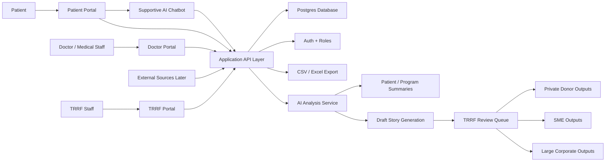

# System Architecture

## Recommended stack

- `Next.js` for the full web application
- `Supabase Auth` for login and role-based access
- `Supabase Postgres` for the main database
- `Vercel` for deployment and server-side AI/API routes
- `OpenAI Responses API` for chatbot, analysis, and story drafting
- `CSV / Excel export` generated server-side

For the first demo, the chatbot and analysis flows should be simulated rather than powered by a live model.

## Why this stack fits

- one application can serve all three roles cleanly
- Vercel is fast for prototype deployment and AI orchestration
- Supabase gives authentication, Postgres, storage, and row-level security in one prototype-friendly stack
- the OpenAI Responses API supports structured AI behavior without putting keys in the frontend

## V1 implementation note

The first prototype should simulate AI behavior using predefined response logic and mock summaries.
This allows the team to validate:

- patient experience
- safety language
- consent gates
- dashboard flows
- doctor and TRRF workflows

before paying the complexity cost of live model integration.

## Product architecture

## Role boundaries

### Patient portal

- conversation UI
- consent prompts
- structured check-ins with a weekly default cadence and configurable scheduling
- longitudinal reflections
- no patient-facing dashboard in v1

### Doctor portal

- assigned-patient list
- patient view
- clickable patient detail page with dashboard, surveys, notes, and timeline
- structured professional surveys
- comments and notes
- de-identified cohort search across hospital cases using cancer type, stage, sex, age range, and treatment filters

### TRRF portal

- dashboards
- cohort and program-level metrics
- clickable patient detail page for individual review
- patient names visible for support coordination
- export actions
- review queue for summaries and stories

## AI responsibilities

### 1. Patient conversation AI

Purpose:

- supportive conversation
- memory across check-ins
- structured information capture

Guardrails:

- no diagnosis
- no treatment recommendations
- ask consent before sensitive data collection
- escalate to human / medical staff when needed

### 2. Analysis AI

Purpose:

- summarize patient trends
- create before/during/after LungFit views
- detect missing data or follow-up gaps
- prepare dashboard-friendly summaries

### 3. Story / report AI

Purpose:

- draft donor-safe stories
- adapt outputs to private donors, SMEs, and large corporates
- generate emotionally resonant but fact-based language

Guardrails:

- input must be approved / consented
- de-identify by default
- no auto-publishing
- TRRF approval required

## Data flow

1. Patient and doctor inputs are collected separately.
2. All structured data is stored in Postgres.
3. AI reads structured data and limited approved narrative context.
4. Dashboards and exports are generated from stored records.
5. Draft donor outputs go through TRRF review before use.

## Doctor access model

- assigned patients: full clinical view allowed inside policy boundaries
- non-assigned hospital patients: de-identified cohort search only

For non-assigned patients, doctors should be able to search by:

- cancer type
- cancer stage
- sex
- age range
- treatment used

For non-assigned patients, the interface should not reveal:

- name
- patient ID
- date of birth
- direct contact details
- free-text content that could identify the patient

This search should support clinical comparison and learning, but the system should not claim to determine the "best treatment" automatically.

## Deployment notes

- keep all AI and database operations server-side
- do not expose API keys in the frontend
- choose Vercel function region intentionally
- keep the database as the source of truth, not the chatbot
