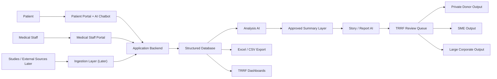
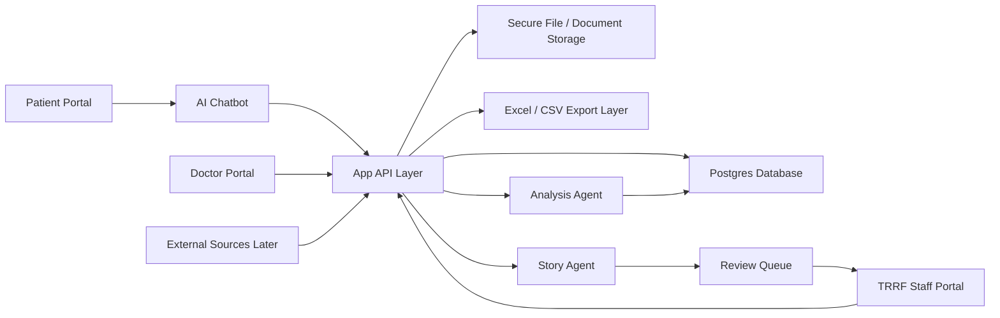

# TRRF Prototype Blueprint

## 1. What I learned from the PDF

The PDF is framed as a donor-impact reporting project, but the core asset underneath it is a data system.

The strongest ideas in the deck are:

- TRRF needs structured, measurable evidence, not just emotional storytelling
- different donor groups need different outputs
- LungFit needs to be explained simply and consistently
- mid-cycle updates and dashboards matter, not only year-end reports
- geographic relevance matters
- privacy, consent, and data credibility are trust-critical
- data collection should not create too much burden for clinical staff

The most important shift for the prototype is this:

The real product should not start as "an AI report generator."

It should start as:

1. a secure data collection system
2. a structured database
3. a role-based review workflow
4. a dashboard and export layer
5. a controlled storytelling layer on top

## 2. Recommended Product Shape

### How your visual flow maps to the real product

Your team diagram is directionally strong. It already captures four useful ideas:

- patient, medical staff, and studies are different data sources
- TRRF sits in the middle as the orchestrator
- a data aggregation layer should exist before reporting
- donor outputs should vary from emotional to CSR-compliant depending on the audience

The main thing I would change is this:

In the slide, `the report = the product`.

For the real prototype, I would redefine that as:

`the data platform = the product`

and:

`reports, dashboards, and stories = outputs of the product`

That change makes the system much easier to build, safer for health-related data, and more useful beyond donor communication.

### What I would keep from your diagram

- the `patient -> chatbot -> structured data` idea
- the `medical staff -> factual/clinical input` idea
- the `data aggregation platform` as the central layer
- the donor segmentation into `private donors`, `SMEs`, and `large corporates`
- the idea that outputs should range from `warm / emotional` to `cold / data-based / CSR-compliant`

### What I would change in your diagram

#### 1. Move the chatbot closer to the patient workflow

Right now the chatbot sits near TRRF conceptually.

For the actual product, the chatbot should be part of the patient portal and write into structured records through the application backend.

#### 2. Put doctors into the product, not beside it

In the slide, medical staff still looks partly outside the core solution.

For the real prototype, doctors and medical staff should be fully inside scope because they are one of the most important trust and validation layers.

#### 3. Split one AI block into three AI roles

Instead of one broad AI concept, I recommend:

- `patient conversation AI`
- `analysis AI`
- `report/story composition AI`

This is much safer than letting one agent handle everything.

#### 4. Add consent and review gates between data and storytelling

The current visual jumps fairly quickly from patient data to donor-facing outputs.

I would insert:

- consent management
- de-identification
- TRRF staff review / approval

before anything donor-facing is generated.

#### 5. Make studies and external sources a later ingestion lane

This part of your visual is useful, but it should stay clearly separate from the first prototype.

For v1:

- patient data
- medical staff data

For v2:

- studies
- hospital systems
- external program evidence

### Revised version of your visual logic



### Core users

- `Patient`: talks to the chatbot, answers check-ins, and fills surveys
- `Doctor / medical staff`: sees assigned patients in full, adds clinical comments, fills medical surveys, reviews progress, and can search de-identified similar hospital cases by clinical filters
- `TRRF staff`: sees program-level dashboards, export views, donor-safe stories, performance summaries, and patient names for support coordination

### What the first working prototype should do

- collect patient baseline information
- collect recurring patient check-ins during treatment and LungFit
- collect doctor survey input on progress and treatment context
- store structured records in a database
- show the same data in a spreadsheet-style export
- generate patient progress summaries and simple risk/status flags
- generate de-identified story drafts for TRRF staff review
- keep patient dashboards hidden from patients in v1
- give doctors and TRRF staff patient-level dashboard drill-down views
- give doctors a de-identified cross-case search tool without exposing non-assigned patient identity

### What should wait until later

- broad external data ingestion
- automatic donor-facing publishing
- complex predictive modeling
- multi-hospital integrations
- full reimbursement / public-health workflow integration

### Confirmed survey inputs

The four confirmed Google Forms currently define the strongest first-pass structure for the prototype:

Patient surveys:

- `General Cancer Patient Self-Report Survey`
- `TRRF Patient Programme Experience & Impact Survey`

Doctor / medical-staff surveys:

- `Medical Staff General Cancer Patient Evaluation Survey`
- `TRRF Medical Staff Programme Impact Survey`

Together, they already cover:

- consent and anonymous tracking
- patient profile and treatment context
- emotional wellbeing
- fatigue, pain, mobility, and daily functioning
- support needs and programme interest
- LungFit programme experience and before/after change
- doctor-assessed progress
- referral suitability
- impact metrics useful for donors or institutions

That means the prototype should not invent a completely new survey model from scratch.
It should start by mapping these real survey structures into the product database and UI flows.

## 3. Best MVP Approach

### Phase 0: define the minimum viable measurement model

Before building the chatbot, lock the first version of the data model:

- patient profile
- consent status
- treatment stage
- LungFit participation
- symptom / quality-of-life check-ins
- adherence / attendance
- doctor assessment
- TRRF notes

This matches one of the best lessons from the PDF: start with a lightweight, credible measurement framework.

### Phase 1: build the secure foundation

- authentication
- 3 role types
- patient-doctor assignment model
- database schema
- audit log
- exportable tables

### Phase 2: build the patient chatbot as a structured intake layer

The chatbot should not "own" the truth. It should gather information and write into structured records through approved tools.

For the first demo, this behavior should be simulated rather than powered by a live LLM API.

The chatbot should do things like:

- collect baseline details
- ask recurring check-in questions
- run a longer structured check-in weekly by default, while allowing configuration by patient or program
- ask follow-up questions when answers are unclear
- save answers as structured entries
- show empathy and continuity

The chatbot should not:

- make clinical decisions
- promise medical conclusions
- produce donor stories directly
- overwrite reviewed doctor input

### Phase 3: build doctor and TRRF dashboards

- doctor view: assigned patients, trends, notes, survey responses, patient drill-down pages, and de-identified cohort search
- TRRF view: program dashboard, cohort trends, export tables, story review queue, and patient drill-down pages

### Phase 4: add the analysis and storytelling agents

- analysis agent: creates summaries, trends, flags, dashboard metrics
- storytelling agent: drafts donor-safe narratives from approved, de-identified source material only

## 4. Recommended System Architecture



### Suggested stack

- `Next.js` web app for all three portals
- `Vercel` for deployment and server-side API routes / functions
- `Supabase` for Auth, Postgres, Storage, and Row Level Security
- `OpenAI Responses API` for chatbot and agent workflows

### Why this stack fits

- one web app can serve all three roles cleanly
- Vercel is good for fast iteration and AI-heavy server routes
- Supabase gives you auth plus a relational database with strong access control
- OpenAI tools and structured outputs fit well for chatbot collection and summary generation

## 5. Important Changes I Recommend

### 1. Do not make Excel a primary data store

Use Excel only as:

- a downloadable export
- a manual review format
- a quick donor/internal reporting artifact

The source of truth should be the database.

### 2. Separate clinical data from donor-story data

Use at least three layers:

- `raw conversational data`
- `structured health/program data`
- `approved donor-safe narrative data`

That separation will save you a lot of trouble later.

### 3. Add explicit consent and approval checkpoints from day one

You need separate approval concepts for:

- participation consent
- data processing consent
- donor-story / quote consent
- media consent if audio/video is ever used

### 4. Make the doctor review step part of the workflow

The patient chatbot can gather useful information, but a clinician or medical staff member should be able to:

- confirm or contextualize progress
- add treatment notes
- mark sensitive items
- suppress content from story generation

### 5. Start with one hospital / one country / one patient cohort

Do not begin with "all TRRF."

A better first prototype is:

- one LungFit cohort
- one doctor/admin workflow
- one TRRF dashboard
- synthetic or carefully de-identified sample data at first

### 6. Story generation should be review-first, not auto-publish

The AI should draft.
TRRF staff should approve.

That is especially important because the PDF already surfaced trust, privacy, and donor credibility as central risks.

## 6. Suggested Role Model

### Patient

Can:

- sign in
- chat with assistant
- fill surveys
- view own timeline and progress
- manage basic preferences and consent

Cannot:

- see other patients
- see internal notes
- see donor-facing drafts

### Doctor / medical staff

Can:

- see assigned patients
- complete staff surveys
- add comments
- review check-ins
- view trends and alerts

Cannot:

- see unrelated patients
- publish donor content

### TRRF staff

Can:

- see program dashboards
- view doctor and patient records according to policy
- see patient names so support can be delivered to the correct person
- export tables
- review narrative drafts
- manage donor reporting workflows

Should be split later into:

- `program manager`
- `admin`
- `story/reports reviewer`

## 7. Suggested Database Shape

You do not need every table on day one, but this is a strong starting point.

### Core entities

- `users`
- `profiles`
- `roles`
- `patients`
- `medical_staff`
- `trrf_staff`
- `patient_assignments`

### Program and health data

- `programs`
- `program_enrollments`
- `treatment_plans`
- `patient_checkins`
- `patient_surveys`
- `staff_surveys`
- `clinical_notes`
- `lungfit_sessions`
- `attendance_records`
- `outcome_metrics`

### AI and reporting data

- `chat_threads`
- `chat_messages`
- `structured_extractions`
- `analysis_runs`
- `patient_summaries`
- `story_drafts`
- `story_approvals`

### Governance data

- `consents`
- `audit_logs`
- `export_jobs`
- `source_documents`

## 8. AI Responsibilities

### Patient chatbot

Use for:

- onboarding
- reminders
- check-ins
- structured question flows
- empathetic responses

Not for:

- diagnosis
- treatment advice beyond approved scripts
- unsupported claims

### Analysis agent

Use for:

- summarizing patient trajectories
- detecting missing follow-ups
- creating dashboard-ready metrics
- preparing staff review briefs

### Story agent

Use for:

- drafting patient journey narratives
- adapting output by donor audience
- extracting emotionally resonant but factual themes

Guardrails:

- use only consented content
- de-identify by default
- route all output to human review

## 9. Dashboard Design Recommendation

Build two dashboard layers.

### Clinical / program dashboard

- active patients
- adherence / attendance
- latest check-in status
- quality-of-life trend
- missing survey flags
- doctor comments
- cohort-level outcomes

### Donor / story dashboard

- approved stories
- program metrics by region
- impact summaries
- exportable visuals
- donor-segment filters later

For the first prototype, only TRRF staff should access donor/story views.

## 10. Security and Privacy Notes

This part matters a lot.

Because this system touches health-related data, I recommend:

- use synthetic or de-identified data first
- avoid putting unnecessary identifiers into prompts
- keep identifiable data separate from story generation inputs
- log who viewed or changed sensitive records
- define retention rules early
- define a manual incident process early

Two especially important implementation notes from current vendor docs:

- OpenAI documents that API data is not used for training by default, but default abuse-monitoring logs may still be retained for up to 30 days unless you have approved data controls in place
- OpenAI documents that background mode stores response data for roughly 10 minutes and is not Zero Data Retention compatible

For the prototype, my recommendation is:

- keep patient-facing AI requests synchronous at first
- avoid background mode for sensitive flows
- review DPA / data-control setup before using live patient data

Also note:

- Vercel functions default to `iad1` (Washington, D.C.) for new projects, so if you use Vercel for EU patient data, explicitly set the function region close to the database

## 11. Why Vercel Still Makes Sense

Yes, Vercel is a reasonable choice for the AI communication layer, with one caveat:

Use Vercel for the app and server routes, but make the database and access-control design the real foundation.

Why I would use it:

- fast deployment and iteration
- clean Next.js support
- easy streaming responses
- good fit for a multi-portal prototype

What to watch:

- function region must be configured intentionally
- sensitive server logic must stay server-side
- long-running jobs may later need a dedicated async workflow

## 12. Recommended Repo Structure

```text
docs/
  trrf-prototype-blueprint.md
apps/
  web/
packages/
  ai/
  db/
  ui/
supabase/
  migrations/
  seed/
```

If you want a simple start, we can even begin with:

```text
apps/web
docs
supabase/migrations
```

## 13. Best First Build Order

1. Settle the minimum data fields for patients, doctors, and LungFit tracking.
2. Define the three roles and exact permissions.
3. Create the database schema and row-level policies.
4. Build sign-in and the three dashboard shells.
5. Build the patient chatbot as a structured intake/check-in tool.
6. Build doctor survey input and patient review pages.
7. Build TRRF exports and the first dashboard.
8. Add analysis summaries.
9. Add reviewed story drafts.

## 14. My Recommendation for the First Demo

For a convincing TRRF presentation, the first demo should show:

1. Patient logs in and completes a chatbot check-in.
2. Doctor logs in and reviews that patient with added comments.
3. TRRF staff logs in and sees a patient progress dashboard, a spreadsheet-style export, and one reviewed donor-safe story draft.

That would already communicate the full system vision without overbuilding.

## 15. How donor outputs should differ

Your donor ladder in the visual is a very good product idea, and I would keep it.

### Private donors

Best output mix:

- human story first
- simple impact numbers second
- updates over time

### SMEs

Best output mix:

- one story
- one-page impact summary
- team-shareable report
- optional employee engagement module

### Large corporates

Best output mix:

- KPI dashboard
- compliance / audit trace
- region- and CSR-specific reporting
- optional embedded reporting widget later

This means the system should not generate one universal report.
It should generate a donor-type-specific output from the same reviewed underlying data.

## 16. Open Questions For Our Next Conversation

These are the three most important things to clarify next:

1. Should the first prototype use fully synthetic data, or do you expect real pilot data immediately?
2. Is the first live context Spain only, Portugal too, or still undecided?
3. For version 1, do you want donor reporting included in the demo, or should we focus first on the patient-doctor-TRRF workflow only?

## 17. Current Official References

- OpenAI Responses API: <https://platform.openai.com/docs/api-reference/responses?lang=node>
- OpenAI tools / function calling: <https://platform.openai.com/docs/guides/tools?api-mode=responses>
- OpenAI structured outputs: <https://platform.openai.com/docs/guides/structured-outputs?api-mode=chat>
- OpenAI data controls: <https://platform.openai.com/docs/guides/your-data>
- OpenAI background mode: <https://platform.openai.com/docs/guides/background>
- OpenAI enterprise privacy: <https://openai.com/policies/api-data-usage-policies/>
- Vercel Functions: <https://vercel.com/docs/functions/>
- Vercel function regions: <https://vercel.com/docs/functions/configuring-functions/region>
- Vercel DPA: <https://vercel.com/legal/dpa>
- Supabase Auth with Next.js: <https://supabase.com/docs/guides/auth/quickstarts/nextjs>
- Supabase Realtime authorization / RLS pattern: <https://supabase.com/docs/guides/realtime/authorization>
